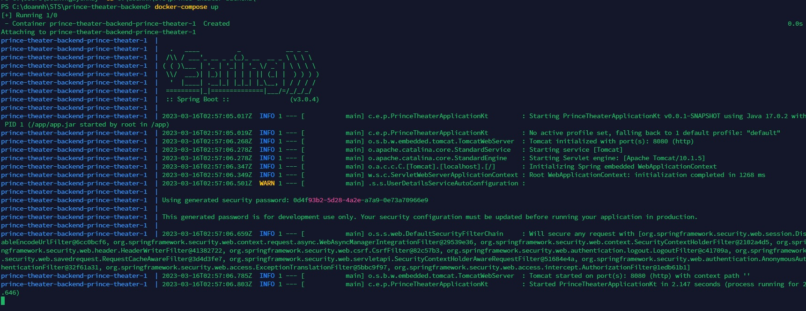
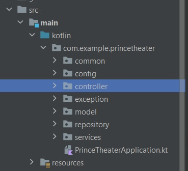
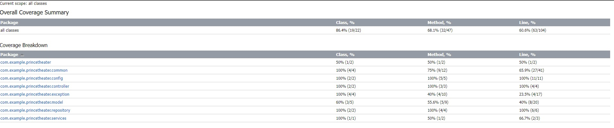

# Prince Theater
The movie price comparison sample project between Filmworld and Cinemaworld theater. People can see which film is available and compare price between two cinemas.\
This system integrate api from lexicon api https://challenge.lexicondigital.com.au/api/v2/{provider}/movies and wrap them as a datasource of the project.
-------
## Build & Run the Prince Theater Backend
Before building the project, must prepare:
- Clone source code from [github](https://github.com/stsdoannguyenhuy/prince-theater-backend)
- Install [Intellij](https://www.jetbrains.com/idea/) if you want to run directly from source code
- Install [Docker](https://www.docker.com/) and [docker-compose](https://docs.docker.com/compose/install/) if you want build and run it on docker (recommend way) and open start docker service

After finishing preparing steps, come to the building & running steps
* If run directly from source code
    * Open Intellij and select `File->Open` and navigate to the root directory of the project.
    * Then select the directory choose the `build.grale` in the cloned repo.
    * After that, click `OK` to open the project in Intellij. In this step, gradle will sync and download the needed library.
    * Finally, after gradle sync successfully, Select `Run -> Run 'PrinceTheaterApplication'` from the menu or press `shift + f10` to run application.
* If run by docker (recommend)
    * Open `terminal` and navigate to the root directory of the project.
    * Run command `docker-compose up`. After running these steps, will see the image below


Then, open the browser and go to `http://localhost:8080/films?provider=filmworld` to ensure everything works fine.
## APIs
The system provided api to get film from 2 providers: `cinemaworld` and `filmworld`. In order to get film: (please run the project first)
- From `filmworld`, run command `curl --location 'localhost:8080/films?provider=filmworld' \
  --data ''`
- From `cinemaworld`, run command `curl --location 'localhost:8080/films?provider=cinemaworld' \
  --data ''`

The sample response of these apis are: 
````
{
    "code": 200,
    "message": "",
    "body": {
        "provider": "Cinema World",
        "movies": [
            {
                "id": "cw2488496",
                "title": "Star Wars: Episode VII - The Force Awakens",
                "type": "movie",
                "poster": "https://m.media-amazon.com/images/M/MV5BOTAzODEzNDAzMl5BMl5BanBnXkFtZTgwMDU1MTgzNzE@._V1_SX300.jpg",
                "actors": "Harrison Ford, Mark Hamill, Carrie Fisher, Adam Driver",
                "price": 24.7,
                "priceAsString": "$24.7"
            }
        ]
    }
}
````

## Main language and library
- [Kotlin](https://kotlinlang.org/)
- [Spring boot 3.0.4](https://spring.io/)
- JDK 17
- Mockito

## Source code structure

- `PrinceTheaterApplication.kt` the main function, the beginning point of application
- `config` holds the config of system, Such as security, filter...
- `controller` contains all controllers of system
- `exception` the custom project exception
- `model` DTOs and POJO
- `repository` all repositories of system (data access layer)
- `services` services, all business logic should be handled here

## Testing
### 3rd api testing
Call multiple times to [3rd api](https://challenge.lexicondigital.com.au/api/v2/{theater}/movies) with provided key. I saw some results:
- <span style="color:green">Success 200</span> with data in body. Response body is never changed if code is success
- <span style="color:orange">Forbidden 403</span> if do not pass or pass wrong `x-api-key` in header. Just ignore this case, application always pass the authorized `x-api-key`
- <span style="color:red">Bad Gateway 502 or Internal server error 500</span> sometimes occur. In this case, Prince Theatre application will try 3 times before responsing an error

### Unit test
Please read the [test report](./documentation/test/index.html) here



